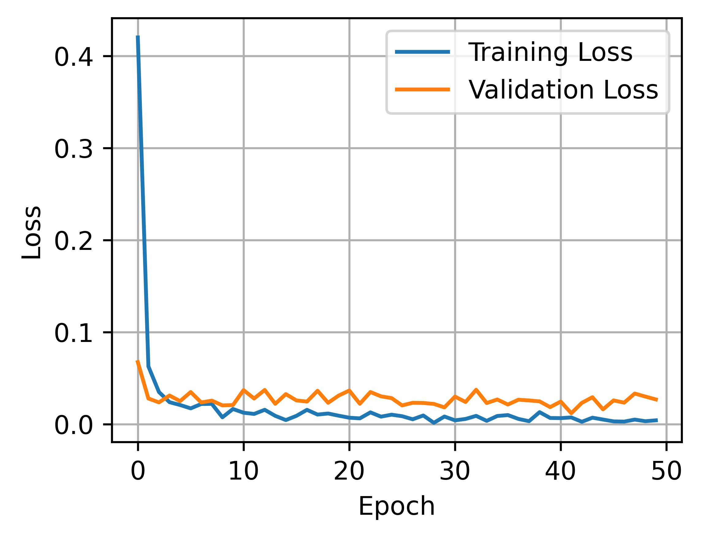
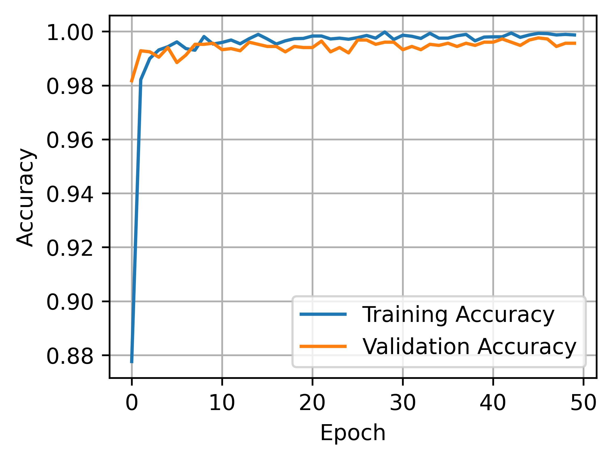

# Team_SIOL

## Automated Neural Architecture Search for Optimal Model Design

This project leverages Neural Architecture Search (NAS) using AutoKeras to discover the best-performing model architecture for our task automatically. We start with a search space, utilize NAS to explore and optimize model structures, and then retrain the best-found architecture from scratch to leverage its full potential. Finally, we saved the optimized model weights and provided a script to evaluate the model on unseen test data for the **AI Club Campus Vision Challenge**.

### Neural Architecture Search (NAS)

NAS is a technique that aims to discover optimal neural network structures, often using AutoML tools like AutoKeras. The goal is to identify high-performance architectures that outperform manually designed models through a search process that evaluates possible configurations.

The process consists of three main components:

1. **Search Space:** In this project, we utilized the original search space defined in the ```AutoKeras``` library. This search space included the normalization layer, augmentation layer, and feature extraction block type. On top of these, we had the classification layer that involved the choice of spatial reduction type and several dropout options. The spatial reduction types included different transformations of the features including flattening, taking the global average, or global maximum. The search space also included the choice of the optimizer and learning rate. Moreover, the augmentation layer had several options: translation, horizontal flip, vertical flip, rotation, zoom, and contrast. The most important choice in this search space is the choice of feature extraction block. The options for this block include a vanilla architecture with several convolutional, max-pooling, and dropout layers; several ResNet architectures; an Xception architecture; and several EfficientNet architectures.
2. **Search Strategy:** We employed Bayesian Optimization (BO) as the search strategy. Using BO we tried to solve the following optimization problem:

&nbsp; &nbsp; &nbsp; &nbsp; &nbsp; &nbsp; &nbsp; &nbsp; &nbsp; &nbsp; &nbsp; &nbsp;  &nbsp; &nbsp; &nbsp; &nbsp; &nbsp; &nbsp;  &nbsp; &nbsp; &nbsp; &nbsp; &nbsp; &nbsp; &nbsp; &nbsp; &nbsp; &nbsp; &nbsp; &nbsp; &nbsp; &nbsp; &nbsp; &nbsp; &nbsp; &nbsp;  &nbsp; &nbsp; &nbsp; &nbsp; &nbsp; &nbsp; **Objective:**

$$\arg\max_{C_{lik_i}} f(C_{lik_i}, X, y)$$

&nbsp; &nbsp; &nbsp; &nbsp; &nbsp; &nbsp; &nbsp; &nbsp; &nbsp; &nbsp; &nbsp; &nbsp;  &nbsp; &nbsp; &nbsp; &nbsp; &nbsp; &nbsp;  &nbsp; &nbsp; &nbsp; &nbsp; &nbsp; &nbsp; &nbsp; &nbsp; &nbsp; &nbsp; &nbsp; &nbsp; &nbsp; &nbsp; &nbsp; &nbsp; &nbsp; &nbsp;  &nbsp; &nbsp; &nbsp; &nbsp; &nbsp; &nbsp; **Subject to:**

$$\sum_{i=1}^{n}\sum_{k_i=1}^{G_i}C_{lik_i} = 1 , \quad \forall \quad l$$

$$C_{lik_i} \in {0,1}, \quad \forall \quad l, i, k_i$$

$$k_i \in \mathbb{N}, \quad \forall \quad i$$

where $f$ is the objective function, in this case, validation accuracy, $C_{lik_i}$ denotes the $i$-th operation with $k_i$-th setting is selected at $l$-th layer if  $C_{lik_i}=1$, otherwise $C_{lik_i}=0$. $G_i$ is the total number of setting options for the $i$-th operation. For instance, `translation_factor` is an operation in the `augment` layer with two setting choices of 0.0 and 0.1.

3. **Performance Estimation Strategy:** We evaluated the best model in terms of validation accuracy. We divided the original training data into training and validation sets. 


## Code Usage

### Running the NAS Script

To run the NAS on the training dataset, use the following command and specify the directories:

```bash
python nas.py --data_dir path/to/dataset --result_dir path/to/results --model_save_path path/to/best_model.keras --best_weights_file path/to/best_weights.h5
```

At this point, you will have a summary of the best model and the best model is saved. However, this model is not suitable for submission for competition purposes. Therefore, we developed the code for this best architecture from the model summary and used the same parameters obtained by the optimization process. In the next step, we provide the instructions for running the script to retrain this best model. This model is the best for our dataset, but it could be different for your custom dataset. 

### Retraining the best architecture from scratch using training data

To retrain the best model obtained in NAS using the training data, use the following command and specify the directories:

```bash
python train.py --data_dir path/to/dataset --result_dir path/to/results --best_weights_file path/to/results/best_model.weights.h5
```

#### Training and Validation Loss and Accuracy Plots:

  

#### Performance metrics on the validation set (80:20 split):

| Metric | Accuracy | Precision | Recall | F1-Score | Log Loss |
|---|---|---|---|---|---|
| Value| 0.9984 | 0.9984 | 0.9984 | 0.9984 | 0.0069

We will save the best model weights after training and use them for future evaluation of unseen data from the same label space.

### Evaluating the best model on test data

To evaluate the trained model on a new test dataset, use the following command and specify the directories:

```bash
python evaluate_model.py --test_dir path/to/test_data --weights_path path/to/best_model.weights.h5
```

## Acknowledgements
1. **AutoKeras** - https://autokeras.com/ - for the NAS framework.
2. **MSU AI Club** - https://www.msuaiclub.com/ - for the dataset and opportunity to participate in the **AI Club Campus Vision Challenge**.
